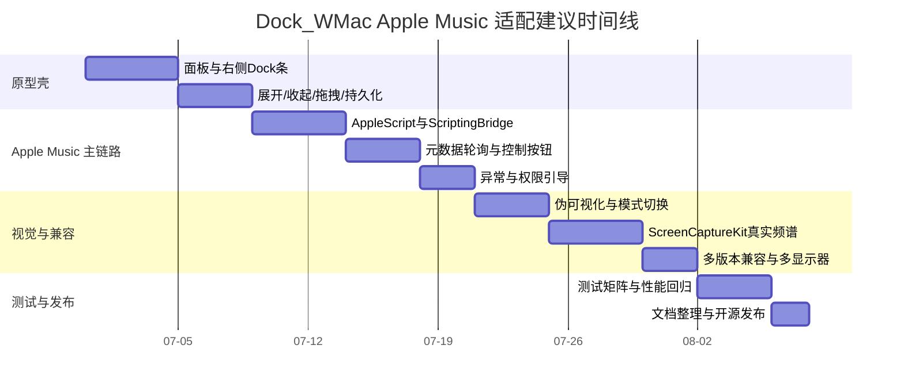

# Dock_WMac 适配 Apple Music 的桌面简易播放器开发说明书

## Executive summary

这次调研里，最有参考价值的三类样本并不是“同一种播放器”，而是三种不同的产品路径。ANYNC 的 TaskbarLyrics 代表“轻量、强状态机、贴着系统 UI 做歌词层”的路线：它依赖 Windows 的 SMTC 识别当前播放内容，做双行歌词、平滑切换、纯音乐频谱与多源歌词并发检索，本体是 .NET 8 Windows 应用，安装时还要求 WebView2 Runtime。Wallpaper 创意工坊里的“音域回响”代表“把播放器做成桌面视觉容器”的路线：核心是 160×160 柱状网格、实时 FFT、专辑封面与媒体信息卡片，明显建立在 Wallpaper Engine 的音频可视化与媒体集成能力之上。XxHuber 在抖音传播的“可视化音乐播放器”，公开可校验的开源对应物是 XxHuberrr/Mineradio：它把天气电台、搜索播放、歌词舞台、粒子视觉和 3D 歌单架组合成沉浸式桌面音乐空间，技术栈是 Electron、GSAP、NeteaseCloudMusicApi 等，许可证为 GPL-3.0；其公开 issue 还出现了“接入 apple music”的需求，说明 Apple Music 桌面生态在这类个人开发播放器里仍是空位。citeturn5view0turn18search3turn20search0turn20search1turn16search0turn16search1turn17search0turn19view0turn19view1turn17search7

对 Dock_WMac 而言，正确的结论不是把现有 Windows Dock 代码“硬移植”到 macOS，而是在仓库里增设一个 **macOS 专用播放器实验目标**。原因很直接：Dock_WMac 当前公开的主线是 Windows 10/11、C++17、Qt6 Widgets、DWM/Win32 集成，它的窗口预览、模糊、钩子与任务栏互动都建立在 Windows 系统层之上；而你要实现的目标——右侧 Dock 条、向上展开的透明页面、毛玻璃、辅助窗口层级、Apple Music 自动化——在 macOS 上更自然的基座是 AppKit 的 `NSPanel`、`NSWindow`、`NSVisualEffectView`、`NSAnimationContext`、`NSScreen.visibleFrame`、Apple Events 和可选的 MusicKit。citeturn4view0turn4view2turn23search0turn23search6turn24search0turn24search4turn26search0turn26search2turn26search9

V1 的推荐集成路线应当是：**把 macOS Music 应用本身当作播放引擎**，你的项目只做一个桌面侧边“伴生层”。也就是说，播放控制和当前曲目信息优先通过 `NSAppleScript`/Scripting Bridge 去读写 Music；如果用户在 macOS 13+ 且愿意授权屏幕/系统音频录制，再用 ScreenCaptureKit 的音频捕获拿到实时振幅做可视化；如果未来你愿意把播放器本身做进 App 内，再在 macOS 14+ 增加 MusicKit 的 `ApplicationMusicPlayer` 实验模式。这样能把兼容性、权限成本和产品语义分开：V1 是“跟随 Apple Music 的桌面播放器外壳”，V2 才是“在你自己的 app 里直接播 Apple Music”。citeturn32search0turn32search1turn30search0turn30search2turn30search4turn7search0turn7search23turn12search19turn14search9turn14search13

本报告最重要的范围判断是：**不要把 Apple Music 的自动时间轴歌词列为 V1 必需项**。公开文档里，MusicKit 和 Apple Music API 明确提供了授权、播放、目录检索、最近播放、个性化内容等能力；公开的 Apple Music API 资源属性里也能看到“歌曲是否有歌词”的标志位，本地媒体项还有 `lyrics` 字段，但我没有查到可稳定、公开、适用于第三方桌面浮层的 Apple Music 时间轴歌词接口。与此同时，开发者论坛里已经有人讨论利用 web token 去访问“公开文档之外”的 lyrics 能力，这恰恰说明这部分对第三方并不是稳妥的公开能力。因此，对开源项目来说，更稳妥的范围是：V1 必做 **元数据、控制、状态机、透明面板、简易/真实可视化**；歌词能力在 V1 只做“容器 + 本地 LRC / 用户自定义歌词”，而不是承诺“Apple Music 原生同步歌词”。这既更符合公开 API 现实，也能显著降低维护风险。citeturn27search0turn27search2turn27search3turn27search9turn27search11turn27search8

基于以上判断，推荐的开发策略是：**交互借鉴 TaskbarLyrics，视觉节奏借鉴音域回响，模式切换借鉴 Mineradio，但实现基底坚持原生 AppKit + Swift，且保持 MIT 项目的许可边界**。尤其要注意，ANYNC/TaskbarLyrics 是 MIT，可以参考甚至复用思路；Mineradio 是 GPL-3.0，只宜参考产品结构与交互，不宜把其代码直接移入 MIT 的 Dock_WMac 主仓库，否则会牵动整个衍生代码的许可义务。citeturn22view2turn5view0turn19view2turn19view0

按“非沙盒、不开 App Store 流程、首次仅 Apple Music”这个前提，完整 MVP 的合理工时大约在 **90–130 小时**：其中基础桌面壳与状态机 24–32 小时，Apple Music 自动化桥接 18–26 小时，透明页面与动画 16–24 小时，可视化 12–24 小时，权限/异常/测试收尾 20–24 小时。若只做“元数据 + 控制 + 页面展开 + 伪可视化”，可以压到 **60–80 小时**。下面的详细说明书按这个范围展开。  

## 中文互联网近期播放器样本观察

从近一年的中文互联网公开痕迹看，这一波“播放器”产品并不是传统意义上的“本地音乐管理器复兴”，而更像是 **AI/vibe-coding 传播语境下的桌面体验再包装**：抖音内容里，XxHuber 的项目经常和 `#vibecoding大赏`、`#ai` 一起出现；但当你追到可验证的公开仓库，看到的仍然是 Electron、前端动画、媒体平台接入、桌面壳与本地缓存，而不是“播放器内部靠 AI 实时生成核心能力”。因此，对你的项目最有价值的不是“AI”这层标签，而是它们在 **视觉表达、状态切换、权限边界、轻重分层** 上的实际工程做法。citeturn16search0turn16search2turn18search16turn19view0turn19view1

就产品形态而言，这些案例大致分成三种：第一种是 **贴系统 UI 的悬浮层**，TaskbarLyrics 最典型，强调歌词和频谱对“当前播放源”的跟随；第二种是 **把桌面当作播放器背景层**，音域回响把 FFT 与专辑封面控制器做成桌面视觉对象；第三种是 **把播放器做成一个独立的沉浸式桌面空间**，Mineradio 则把视觉、歌单、推荐、歌词和平台接入都包进同一个壳。对 Dock_WMac 而言，你的右侧 Dock 条最适合吸收第一类的轻量状态机，再局部吸收第二类的视觉语言，而不建议一开始就走第三类的“全功能桌面生态”。citeturn5view0turn18search3turn19view0

| 参考项目 | 公开定位 | 关键功能 | 主要实现线索 | 许可 | 优点 | 局限与风险 |
|---|---|---|---|---|---|---|
| ANYNC/TaskbarLyrics | Windows 任务栏歌词工具 citeturn5view0 | 双行任务栏歌词、黑白主题切换、纯音乐频谱、歌词源优先与跨源检索、多播放器识别顺序 citeturn5view0 | 通过 SMTC 识别当前歌曲；源码构建目标为 `net8.0-windows10.0.22621.0`；运行时需要 WebView2 Runtime citeturn5view0turn22view0 | MIT citeturn22view2 | 状态机清晰，歌词容错与缓存策略成熟，适合作为“轻壳层”参考 citeturn5view0 | 强依赖 Windows SMTC 与任务栏语义，不能直接迁移到 macOS；其核心亮点是歌词检索，不是透明面板视觉 citeturn5view0 |
| Wallpaper 音域回响 | Wallpaper Engine 创意工坊音乐视觉壁纸 citeturn18search3 | 160×160 柱子网格、实时 FFT、低频波纹、高频流星、10 套主题、专辑封面、悬浮毛玻璃控制器、多参数调节 citeturn18search3 | Wallpaper Engine 的音频可视化每帧大约 30 次回调，双声道共 128 个频段样本；媒体集成可读标题、艺术家、封面与封面主色 citeturn20search1turn20search0turn20search6 | 未公开开源许可；公开可见的是创意工坊分发页，未见源码仓库 citeturn18search3 | 视觉表达强、参数化程度高、对“播放器像桌面艺术装置”有很强启发 citeturn18search3 | 依赖 Wallpaper Engine 运行时与其媒体/音频接口；它更像壁纸而非独立播放器壳，且公开资料不足以确认具体实现细节 citeturn18search3turn20search3 |
| XxHuber 可视化播放器 | 抖音传播中的“可视化音乐播放器”，公开开源对应为 XxHuberrr/Mineradio citeturn16search0turn16search1turn17search0 | 天气电台、搜索播放、歌词舞台、粒子视觉、3D 歌单架、网易云/QQ 接入、自定义歌词/封面、更新检测 citeturn19view0 | Electron 主进程加载本地服务；依赖 `electron`、`gsap`、`NeteaseCloudMusicApi`、`mpg123-decoder`；公开 issue 中有“接入 apple music”“非官方 macOS 适配维护版分享” citeturn19view1turn17search7 | GPL-3.0 citeturn19view2turn19view0 | 视觉系统完整，模式切换与沉浸氛围非常强，最接近“桌面舞台”概念 citeturn19view0 | Electron 体量较大；跟第三方音乐平台耦合深；Apple Music 仍是待实现需求；代码许可不适合直接搬进 MIT 项目 citeturn17search7turn19view2 |

把这三类样本综合起来，Dock_WMac 的最佳定位不是“再造一个 Mineradio”，也不是“复刻 TaskbarLyrics 到 macOS”，而是做一个 **右侧停靠、轻量展开、视觉克制、目前只跟 Apple Music 协作的桌面伴生播放器**。这个产品定义既保留了你现有 Dock 项目的基因，也能避开 Apple Music 歌词与授权边界最硬的部分。  

## 产品定义与交互原型

### 功能清单

下表把功能拆成“必需、可选、未来扩展”三层。这里的分层故意把“Apple Music 自动同步歌词”从必需项移出，因为公开 API 信息不足；如果在需求层坚持把它列成必需，你会被迫转向不稳定或未公开接口。citeturn27search0turn27search2turn27search11

| 级别 | 功能 | 说明 | 备注 |
|---|---|---|---|
| 必需 | 右侧 Dock 条 | 停靠在主屏或用户选定屏幕右侧，常驻一枚 Apple Music 图标与运行状态点 | 初版只支持单图标，避免过早变成完整 Dock |
| 必需 | 点击向上展开透明页 | 从图标顶部向上展开一个背景透明/毛玻璃的悬浮页 | 交互目标直接对应你的需求 |
| 必需 | Now Playing 元数据 | 曲名、歌手、专辑名、播放状态、进度、封面（最佳努力） | 由 Apple Music 集成层提供 |
| 必需 | 基础控制 | 播放/暂停、上一首、下一首、打开 Music.app | V1 不做队列编辑 |
| 必需 | 三种显示状态 | 折叠态、展开态、无权限/未播放空态 | 空态必须可诊断 |
| 必需 | 拖拽与记忆位置 | 支持沿右边缘上下拖拽；按显示器 UUID 记忆位置 | 多显示器切换时回到屏幕可见区域 |
| 必需 | 透明与模糊 | 背景透明，内容层可毛玻璃，可在“降低透明度”或低性能机上降级为纯色半透明 | 不把模糊做成硬依赖 |
| 必需 | 可视化容器 | 提供至少一种可视化区域：无系统音频权限时显示“伪可视化”，有权限时显示真实音频响应 | 这样 11–14 都能跑 |
| 必需 | 本地配置 | 位置、尺寸、透明度、展开模式、动画开关、权限状态持久化 | JSON 或 plist 即可 |
| 可选 | 本地 LRC / 自定义歌词 | 用户手动导入 `.lrc` 或自定义文本，按标题/艺术家/时长做匹配 | 这是最现实的歌词路径 |
| 可选 | 系统音频真实可视化 | macOS 13+ 用 ScreenCaptureKit 捕获音频做 32/64 bin 频谱 | 需要系统授权 citeturn30search0turn30search2turn30search4 |
| 可选 | 主题联动 | 用封面主色生成渐变与高亮色 | 音域回响式灵感 |
| 可选 | 开机启动 | 登录项启动 | 建议后置 |
| 未来扩展 | MusicKit 原生播放模式 | macOS 14+ 用 `ApplicationMusicPlayer` 作为实验模式 | 这会把产品从“伴生层”推向“播放器本体” citeturn7search23turn12search19 |
| 未来扩展 | 智能歌词匹配 | 参考 TaskbarLyrics 的跨源歌词匹配思路，但只对用户自行提供的歌词源或自建索引开放 | 避免版权与平台合规问题 citeturn5view0 |
| 未来扩展 | 多音乐源 | Spotify、网易云、QQ 音乐 | V1 明确不做 |

### UI 与交互原型

建议把页面做成“**窄条折叠 + 中等高度展开页**”的两段式结构，而不是全屏或宽面板。原因是：TaskbarLyrics 的成功在于“低干扰”，音域回响的魅力在于“视觉集中但不侵吞桌面”，二者共同点都是 **让播放器成为配角**。citeturn5view0turn18search3

下面这张 ASCII 草图给出建议布局：

```text
折叠态（停靠在右侧）
┌──────┐
│  ♪  │   ← 56×56 热区，悬停可放大到 60
│   •  │   ← 运行指示点
└──────┘

点击后向上展开
                         右侧屏幕边缘
                             │
┌────────────────────────────┤
│  封面 64   曲名            │
│            艺术家          │
│            00:58 / 03:42   │
│                            │
│  ── hybrid 区域 ─────────  │
│  [ 歌词模式 ]              │
│   当前行高亮               │
│   下一行弱化               │
│                            │
│  [ 可视化模式 ]            │
│   32/64-bin bars / ripple  │
│                            │
│  ⏮   ⏯   ⏭    ⋯            │
└────────────────────────────┘
```

建议的默认尺寸不是“越大越酷”，而是 **折叠态 56×56、展开态 340–380 宽 × 380–460 高**。这个尺寸足够放进封面、两行文本、一块视觉区和控制按钮，也不会像 Mineredio 那样天然走向“桌面中心主舞台”。如果后续要允许用户调大，建议把上限控制在 560 高以内，并在超过 460 时把内容改成滚动或分页。  

### 行为细节

| 行为项 | 建议默认值 | 设计说明 |
|---|---|---|
| 展开触发 | 单击折叠图标 | 不建议 hover 展开，避免误触 |
| 收起触发 | 再次单击；点击外部空白；Esc；切歌 3 秒后可选自动收起 | 自动收起默认关闭 |
| 展开方向 | 锚定右下角图标顶部，向上伸展 | 保证“像从 Dock 图标里弹出来” |
| 展开动画 | 180ms，ease-out；同时做 0→1 透明度与 0.96→1.00 缩放 | 与 AppKit 自带窗口动画解耦 |
| 收起动画 | 140ms，ease-in | 比展开更快，减少拖泥带水 |
| 内容切换 | 歌词/可视化模式切换 120ms cross-fade | 避免硬切 |
| 拖拽规则 | 折叠态支持沿右边缘垂直拖拽；展开态标题区可拖 | 初版不开放自由缩放 |
| 透明度 | 折叠态 0.88；展开态背景表层 0.14–0.22；文字卡片层 0.68–0.78 | 用户可调 |
| 模糊 | 首选 `NSVisualEffectView`；低端机或用户关闭时退化到纯色半透明 | 原生毛玻璃优先 citeturn23search0turn23search8 |
| 点击穿透 | 非交互区可选 click-through；交互控件区绝不穿透 | 用于实现“仅内容响应” citeturn29search0turn29search4 |
| 层级 | 作为辅助面板显示在普通窗口之上，但不抢占全屏 app | 用 `NSPanel`/窗口层级控制 citeturn23search6turn26search9 |

建议把交互状态明确成一个有限状态机，而不是用一堆 view flag 叠加。最少要有：

`idleCollapsed → hoverCollapsed → expandedMetadata → expandedLyrics → expandedVisualizer → permissionMissing → noTrack`

如果你后续愿意把这部分做成可复用模块，建议定义一个 `PanelStateMachine`，让动画、权限、播放器状态和 UI 渲染分层，而不是在控制器里直接堆 if/else。TaskbarLyrics 之所以“看起来简单但不脆”，本质上正是它把播放器识别、歌词检索、主题切换和显示状态分开了。citeturn5view0

## Apple Music 集成与 macOS 兼容策略

### 推荐的集成路线

如果你的真实目标是“**跟随用户已经在用的 Apple Music 桌面应用**”，那么 V1 的优先级应该明确如下：

| 路线 | 适用版本 | 能力 | 是否推荐进 V1 | 说明 |
|---|---|---|---|---|
| AppleScript + `NSAppleScript` | macOS 11+ | 读当前曲目信息；控制播放/暂停/上一首/下一首；打开 Music | 是 | `NSAppleScript` 可加载、编译、执行脚本；是最稳妥的兼容路线 citeturn32search1turn32search7 |
| Scripting Bridge | macOS 11+ | 以 Objective-C/Swift 对象方式控制脚本化应用 | 是 | 官方说明是“用标准 Objective-C 语法控制可脚本化 app”；比拼接脚本文本更可维护 citeturn32search0turn32search16 |
| MusicKit `ApplicationMusicPlayer` | macOS 14+ | 在你的 app 内直接播放 Apple Music，不影响 Music.app 状态 | 否，列为未来扩展 | 官方说明其“不影响 Music app 状态”；这会改变产品语义 citeturn7search23turn12search11 |
| MusicKit 授权与订阅检查 | macOS 12+ / 14+ 更完整 | 请求用户 MusicKit 授权，检查是否可播放目录内容 | 作为 V2 辅助 | `MusicAuthorization.request()` 请求授权；`canPlayCatalogContent` 用于判断订阅播放能力 citeturn8search0turn12search2turn12search10 |
| Apple Music API | 跨平台 Web API | 搜索目录、个性化内容、库数据等 | 仅作元数据增强，不作 V1 核心依赖 | 需要开发者 token；涉及用户特定数据时需要 Music User Token citeturn14search0turn14search3turn14search6turn27search2 |
| MediaPlayer / `MPMusicPlayerController` | Apple 平台 | 控制 app 内或系统音乐播放器 | 不作为 V1 核心 | 文档指出 system music player 会使用 Music app 播放；更适合“让你的 app 成为播放器”而非“补一个桌面伴生壳” citeturn6search1turn7search1 |
| ScreenCaptureKit 音频捕获 | macOS 13+ | 捕获系统/目标内容音频，用于真实可视化 | 可选 | 公开音频捕获能力从 `capturesAudio` 开始，默认关闭，需要用户授权 citeturn30search0turn30search2turn30search4 |

这张表对应的产品结论很简单：**V1 只需把 AppleScript/Scripting Bridge 做扎实**。MusicKit 与 Apple Music API 应被当作“未来增强层”，而不是 MVP 的地基。因为一旦你把 V1 建在 MusicKit 上，你得到的是“自己的 Apple Music 播放器”；而用户现在想要的是“Apple Music 旁边多一个精致的右侧 Dock 播放器外壳”。citeturn7search23turn27search2

### 为什么 V1 应优先 AppleScript 而不是 MusicKit

`ApplicationMusicPlayer.shared` 在官方文档里明确标注支持 macOS 14+，并且它播放的是“属于你的 app 的音乐”，不会影响 Music 应用状态；与此同时，`MusicPlayer.State.playbackStatus` 这类可观察状态在 macOS 14+ 才对齐得比较好。换句话说，MusicKit 在 macOS 14+ 更适合“你自己做播放器”。而你当前的目标是“让一个右侧 Dock 条跟随 Apple Music 工作”，这在产品语义上更接近 **自动化现有 Music 应用**，而不是建立新的播放会话。citeturn7search23turn12search19

AppleScript/Scripting Bridge 的优点是跨 macOS 11–14 一致性更好、产品语义更正确、对用户更自然。公开的 Scripting Bridge 文档把它定义为“控制可脚本化 Apple 和第三方应用的技术”；`NSAppleScript` 则直接负责脚本加载和执行。社区公开脚本也能证明，Music.app 的典型读写内容包括 `current track`、`player state`、播放控制等。需要强调的一点是：**不要依赖 AppleScript 回调式事件模型来做实时刷新**。开发者论坛里已经出现 Music 的 `current track` 脚本行为在更高版本系统中回归不稳定的案例，因此面板状态更新应采用轮询快照，而非订阅式幻想。V1 推荐轮询频率为：展开态 250ms、折叠态 1000ms、空闲态 2000ms。citeturn32search0turn32search1turn10search2turn28search10turn11search3turn11search6

### 权限、隐私与沙盒限制

对于非沙盒、不开 App Store 流程的桌面工具，Apple Events 自动化是最关键的权限边界。Apple 官方文档把 `com.apple.security.automation.apple-events` 说明为“允许 app 提示用户授权其向其他 app 发送 Apple events”的 entitlement；“受保护资源”文档与 Xcode 的受保护资源重置文档也明确列出 `NSAppleEventsUsageDescription` 是发送 Apple Events 时的隐私说明键。也就是说，哪怕你不走 App Store，**如果你做签名/硬化运行时/正式分发，最好仍把 Apple Events 说明与 entitlement 配齐**。citeturn9search1turn9search5turn10search1turn10search3

如果以后考虑做沙盒版本，规则会明显复杂：Apple 官方 QA1888 明确说明，沙盒下应优先使用 `com.apple.security.scripting-targets`；只有当目标 app 没有提供需要的 scripting access groups 时，才考虑 Apple Events temporary exception，而且这是“临时例外”，不应被当作长期策略。开发者论坛里也能看到 Music.app 的一组脚本访问组名，例如 `com.apple.Music.playback`、`com.apple.Music.playerInfo`、`com.apple.Music.library.read` 等。基于你现在“不走 App Store、非沙盒”的前提，这部分只需要在文档里单列说明，不应拖累 V1 开发。citeturn33search2turn33search10turn33search11

对于可视化，如果走 ScreenCaptureKit，则权限边界会从“自动化”扩展到“屏幕/系统音频录制”。官方文档把 ScreenCaptureKit描述为“为 Mac app 增加高性能的屏幕和音频内容捕获”；`capturesAudio` 属性则明确说默认不捕获音频，要显式打开，而且该音频捕获能力公开标注为 macOS 13.0+。这意味着：**V1 的真实可视化必须做成可选项**，并在无权限时优雅降级为“伪可视化/呼吸动效”。citeturn30search0turn30search2turn30search4turn37search12

### Apple Music 元数据、封面与歌词的现实边界

Apple Music API 的公开定位，是目录检索、推荐、最近播放、库与个性化内容访问；你在 Apple 平台上可以通过 MusicKit 自动管理 developer token，也可以在其他平台手工生成 developer token。涉及用户特定数据时，Apple Music API 需要 Music User Token。这个能力非常适合做 **封面补全、艺术家链接、专辑 metadata 丰富化**，但不适合拿来做“本地 Music.app 当前歌曲的桌面浮层主链路”，因为那会把你的桌面伴生层变成“网络授权应用”。citeturn14search0turn14search3turn14search6turn14search9turn14search13

歌词是范围管理里最关键的雷区。公开 Apple Music API 文档能查到“歌曲是否有歌词可用”的布尔属性；MediaPlayer 里还能查到媒体项的 `lyrics` 属性。但我没有查到一个公开、稳定、针对第三方桌面工具的 Apple Music **时间轴歌词** API。开发者论坛里反而有人提到通过 Apple Web 端 privileged token 可触达“文档外 lyrics 能力”，这说明它至少不该被视作开源桌面项目的稳定基础。因此本说明书的明确建议是：**V1 不承诺 Apple Music 原生同步歌词；歌词 UI 要做，但数据源只承诺本地 LRC、自定义文本或未来自建映射。**citeturn27search9turn27search11turn27search8

封面则应采用“最佳努力”策略。社区示例表明，AppleScript 可以从 `artwork 1 of current track` 取得原始 artwork 数据并写出图片，但也有社区问题指出某些 Apple Music 流媒体内容的 artwork 读取并不总是稳定。因此，V1 应把封面获取实现成多级回退：**脚本拿得到就直取；拿不到就显示 SF Symbols 占位；未来再考虑用 Apple Music API 做 match-and-fill。**citeturn36search0turn36search2turn11search16

### macOS 版本兼容矩阵

| macOS 版本 | 建议支持级别 | Apple Music 主链路 | 可视化能力 | 关键注意点 |
|---|---|---|---|---|
| macOS 11 Big Sur | 支持 | AppleScript / Scripting Bridge | 仅伪可视化 | 没有公开、稳定、低成本的系统音频捕获方案可作为 V1 依赖；用 `NSScreen.visibleFrame` 约束面板位置 citeturn32search0turn32search1turn26search0turn26search2 |
| macOS 12 Monterey | 支持 | AppleScript / Scripting Bridge | 仅伪可视化 | 如果未来想接 MusicKit，可提前利用 `canPlayCatalogContent` 判断订阅能力，但仍不建议把 V1 建在 MusicKit 播放上 citeturn12search2turn12search10 |
| macOS 13 Ventura | 强支持 | AppleScript / Scripting Bridge | 真实可视化可选 | `SCStreamConfiguration.capturesAudio` 公开支持 macOS 13+，可把系统/目标内容音频做成频谱 citeturn30search4turn37search3turn37search10 |
| macOS 14 Sonoma | 强支持 | AppleScript 为主；MusicKit native mode 可实验 | 真实可视化可选 | `ApplicationMusicPlayer.shared`、`MusicPlayer.State.playbackStatus` 等可作为 V2 实验分支；V1 仍建议保持 AppleScript 主链路 citeturn7search23turn12search19 |

除了播放接口差异，窗口与布局层面的推荐在 11–14 基本稳定：位置计算应基于 `NSScreen.visibleFrame`，必要时加上 `safeAreaInsets`；窗口扩展/收起建议用 `NSAnimationContext` 做自定义动画，并把 `NSWindow.animationBehavior` 设为 `.none` 或等价的“由应用自控”，避免系统层自动动画与你的展开动画打架。citeturn26search0turn26search16turn23search3turn23search15turn24search4turn24search6

## 性能、隐私、测试与验收

### 性能与资源预算

这里的数字不是“行业真理”，而是适合开源桌面工具的 **工程预算线**。建议你把它们写进 README/开发说明，而不是等实现完再回头补。

| 场景 | CPU 预算 | 内存预算 | GPU/帧率目标 | 说明 |
|---|---:|---:|---:|---|
| 折叠待机 | ≤ 1.5% | ≤ 45 MB | 0–30 FPS | 大部分时间只有 hover 与轮询 |
| 展开元数据页 | ≤ 3% | ≤ 70 MB | 60 FPS | 不开真实频谱，仅做轻微动画 |
| 展开真实可视化 | ≤ 8% | ≤ 110 MB | 60 FPS，低电量/Intel 可降到 30 FPS | ScreenCaptureKit + FFT 是最重路径 |
| 长时运行 8h | 无持续爬升 | 泄漏增长 < 10 MB | 无明显丢帧 | 这是桌面常驻工具的硬指标 |

为达成这个预算，建议采用这些实现原则：可视化层只保留一块主渲染面，不做多重阴影与多层混合；折叠态暂停所有高频计算，只保留低频轮询；真实音频可视化只在展开态且有权限时启用；歌词/元数据变化走 diff 渲染，而不是整页重建；动画尽量交给 Core Animation/AppKit 层，而不是反复在 CPU 侧计算。Core Animation 官方文档本身就强调，它能提供高帧率和平滑动画，同时减少 CPU 负担；ScreenCaptureKit 也被官方定义为高性能捕获框架。citeturn24search5turn24search7turn30search0turn37search12

### 隐私与权限风险评估

这个功能最大的风险不在“代码能否写出来”，而在 **用户第一次看到权限弹窗时是否会信任你**。因此，你的产品文案和授权说明要比普通开源工具更严谨。

| 风险点 | 触发条件 | 风险等级 | 建议 |
|---|---|---|---|
| Apple Events 自动化权限 | 第一次向 Music.app 发 Apple Events | 高 | 首次启动只展示说明，不立刻弹窗；用户主动点击“连接 Apple Music”再请求 |
| 屏幕/系统音频录制权限 | 开启真实可视化 | 高 | 默认关闭真实可视化；单独开关；明确写“仅用于本机频谱，不上传、不录制文件” |
| MusicKit 授权 | 开启未来的原生播放模式 | 中 | V1 不启用；V2 再做 |
| Developer token / Music User Token | 使用 Apple Music API 做增强 | 中 | V1 不依赖；如未来接入，token 只放本机钥匙串，绝不 commit |
| 本地数据暴露 | 配置、缓存、歌词映射、封面缓存 | 中 | 本地文件夹明示；提供清理缓存和彻底重置 |

公开文档足以证明这些权限都是真实存在且应被认真对待的：Apple Events 对应 `NSAppleEventsUsageDescription` 与 automation entitlement；ScreenCaptureKit 对应屏幕和音频内容捕获；MusicKit 对应显式的用户授权请求。对开源项目尤其重要的是，只收集“功能真正需要的数据”，并像 Dock_WMac 现有 README 一样延续“默认不收集遥测”的风格。citeturn10search1turn9search1turn30search0turn30search2turn8search0turn4view2

### 测试用例与验收标准

建议把验收拆成“功能正确”“权限正确”“降级正确”“性能正确”四组，而不是只测能不能播放。

| 测试项 | 用例 | 预期结果 | 验收标准 |
|---|---|---|---|
| 启动与布局 | 首次启动，右侧出现折叠图标 | 图标贴右侧，落在 `visibleFrame` 内 | 三次重启位置一致；主副屏切换后不丢失 |
| 展开/收起 | 单击展开，再次单击收起 | 动画无闪烁、无跳 frame、无异常抢焦点 | 20 次重复操作无错位 |
| Apple Music 未运行 | 面板展开 | 显示“打开 Apple Music”空态 | 不崩溃，不反复弹权限 |
| 当前正在播放 | 显示曲名/歌手/进度 | UI 在 250ms 轮询节奏下稳定更新 | 切歌后 1 秒内完成刷新 |
| 控制按钮 | 播放/暂停/上一首/下一首 | Music.app 对应执行 | 20 次按钮测试无卡死 |
| 权限拒绝 | 拒绝 Apple Events | 给出引导而非空白页 | 页面可恢复到空态 |
| 可视化无权限 | 不授予屏幕/系统音频权限 | 退化为伪可视化 | 不阻塞主功能 |
| macOS 11/12 | 展开页与 AppleScript | 主链路工作 | 无真实频谱也不影响播放控制 |
| macOS 13/14 | 真实频谱 | 开关独立生效 | 开启后频谱响应明显，关闭后立即停采样 |
| 多显示器 | 拖到副屏右侧，再断开副屏 | 回退到主屏可见区域 | 无悬空坐标 |
| 长时稳定性 | 连续运行 8 小时，期间切歌 50 次 | 无内存显著泄漏，无 UI 僵死 | 内存增长 < 10 MB |
| 异常恢复 | Music.app 被强制退出/重启 | 面板回到空态或自动重连 | 不需要重启你的 app |

验收上建议至少满足三条红线：**主链路不依赖网络、不依赖真实可视化权限、不依赖歌词可用性**。也就是说，即使用户没有开启屏幕/系统音频权限、没有 MusicKit 授权、也没有歌词文件，你的产品依然应该能提供“像一个透明桌面简易播放器”的最小价值。  

## 实施路径与技术选型

### 仓库实施策略

Dock_WMac 目前的仓库结构已经相当清晰：UI → Core → System 三层，CMake + Qt6 Widgets，且系统层深度绑定 Win32、DWM、COM 和任务栏语义。对这样一个项目，最危险的做法是把 macOS 功能直接塞进现有 Windows target，让仓库在没有抽象完成前同时背上两套系统语义。更合理的方式是保留主仓工程风格，但新增一个 **macOS 专用目录/目标**，例如：

```text
Dock_WMac/
├── macos_player/
│   ├── App/
│   ├── UI/
│   │   ├── DockStripController.swift
│   │   ├── PlayerPanelController.swift
│   │   └── VisualizerView.swift
│   ├── Core/
│   │   ├── PlaybackSnapshot.swift
│   │   ├── PanelStateMachine.swift
│   │   └── SettingsStore.swift
│   ├── Bridges/
│   │   ├── AppleMusicScriptBridge.swift
│   │   ├── AppleMusicMetadataPoller.swift
│   │   ├── AudioCaptureBridge.swift
│   │   └── MusicKitBridge.swift
│   └── Tests/
└── existing_windows_targets...
```

这样做的好处是两边都继续保持“UI / Core / System 或 Bridges”的思路，但系统细节彻底隔离，既不会污染当前 Windows 代码，也允许你之后决定是否把它独立成 sibling repo。Dock_WMac 当前 README 已经说明它是 Windows 10/11 优先、Win32/DWM 深集成、MIT 许可项目，因此在许可与工程边界上，这种方式最稳妥。citeturn4view2turn4view0

### 推荐技术栈与替代方案

| 方向 | 首选方案 | 替代方案 | 选择建议 |
|---|---|---|---|
| 桌面 UI | AppKit + Swift | SwiftUI 外壳 + AppKit 托底；Qt 6 + Objective-C++ bridge | 你的窗口控制、毛玻璃、面板层级需求很 AppKit；SwiftUI 适合配置页，不适合 V1 做全部窗口行为 |
| 窗口与层级 | `NSPanel`、`NSWindow`、`NSWindow.Level` | 普通 `NSWindow` | 这是“辅助面板”场景，`NSPanel` 语义更对 citeturn23search6turn26search9 |
| 毛玻璃与透明 | `NSVisualEffectView` | 纯半透明色块 | 原生毛玻璃更像系统；降级路径必须有 citeturn23search0turn23search8 |
| 动画 | `NSAnimationContext` + Core Animation | 纯定时器补间 | 不要自己手搓帧循环做窗口动画 citeturn24search0turn24search4turn24search5 |
| Apple Music 自动化 | Scripting Bridge + `NSAppleScript` | 仅 `NSAppleScript`；直接 shell 调 `osascript` | Scripting Bridge 负责可维护性，`NSAppleScript` 负责补边角命令 citeturn32search0turn32search1 |
| 真实可视化 | ScreenCaptureKit + Accelerate FFT | 伪可视化；Metal 专用频谱 | V1 用 Accelerate 足够；不要一开始就上复杂 Metal 频谱 citeturn30search0turn30search2 |
| 设置存储 | `Codable` + JSON / plist | SQLite | 你的配置规模小，没必要过重 |
| 日志 | `os.Logger` 或 `apple/swift-log` | Puppy | 保持系统集成优先；`swift-log` 是成熟通用 API citeturn35search3 |
| 脚本桥接辅助 | 自己生成 Music scripting wrapper；或 `tingraldi/SwiftScripting` | 纯字符串脚本 | 只在你想把脚本桥接彻底类型化时引入；V1 不强依赖第三方 citeturn34search5 |

一句话总结：**V1 优先原生、少依赖、强降级**。  
不要让“可视化很酷”变成“权限重、功耗高、维护难”的借口。

### 可能遇到的技术难点与解决方案

| 难点 | 发生原因 | 建议解法 |
|---|---|---|
| Apple Music 元数据刷新不够实时 | AppleScript/脚本桥不是为高频 UI 推流设计的 | 采用展开态 250ms 轮询；只 diff 必要字段；进度条可本地插值 1 秒内平滑 |
| 播放控制成功，但 UI 状态延迟 | 外部应用状态回写有时慢于命令执行 | 命令后先 optimistic update，再在下一个轮询周期校正 |
| 封面读取不稳定 | 某些流媒体曲目 artwork 取值不一致 | 封面一律 best-effort；取不到则占位 |
| 真实频谱权限成本高 | ScreenCaptureKit 需要用户授权，且 13+ 才完整 | 默认关闭真实频谱；V1 只把它作为增强项 |
| 多显示器与 Dock/菜单栏遮挡 | 不同屏幕 `visibleFrame` 不同，断开显示器会留下失效坐标 | 位置存储必须带屏幕标识，恢复时做边界校正 |
| 点击穿透与交互冲突 | 透明窗口很容易误设为整窗穿透 | 只对非交互区启用 `ignoresMouseEvents`，按钮区永不穿透 citeturn29search0turn29search4 |
| 未来想进沙盒后 AppleScript 失灵 | 需要 scripting-targets 或临时例外 entitlement | 现在先在文档里写明“非沙盒优先”；未来独立做沙盒兼容分支 citeturn33search2turn33search11 |
| 想直接用 Mineradio 的代码/视觉模块 | 许可证不兼容且技术栈差异大 | 只参考交互与视觉语言，不直接挪代码；MIT 主仓保持干净 citeturn19view2turn4view2 |

### 里程碑与估算工时

建议分成三步，而不是一口气做完整版本。

| 里程碑 | 范围 | 预计工时 |
|---|---|---:|
| 原型壳 | 右侧 Dock 条、展开页、收起页、拖拽、配置持久化、空态 | 24–32 h |
| Apple Music 主链路 | AppleScript/Scripting Bridge、元数据轮询、播放控制、异常处理 | 18–26 h |
| 视觉增强与收尾 | 伪可视化、可选真实可视化、权限文案、测试矩阵、Bugfix | 30–48 h |

总计 **72–106 h** 可以完成一个质量合格的“元数据 + 控制 + 透明面板 + 伪可视化”版本；若加入 macOS 13+ 真实频谱、封面最佳努力、完整测试与文档，建议按 **90–130 h** 计划。若是学生开发节奏，按每周 12–15 小时计算，大约是 6–8 周；若连续集中开发，则是 2.5–4 周。



### 最终建议

如果这份说明书只保留一句最重要的话，那就是：

**把 V1 做成一个原生 AppKit 的“Apple Music 桌面伴生层”，而不是一个企图一次性吞下歌词、频谱、音乐授权、目录检索和跨平台适配的“大播放器”。**  
借鉴 TaskbarLyrics 的轻量，借鉴音域回响的视觉，借鉴 Mineradio 的状态切换；但在 Apple Music 这件事上，只站在公开 API 与长期可维护性的那一边。