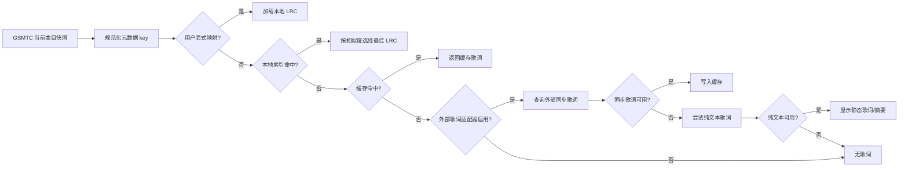
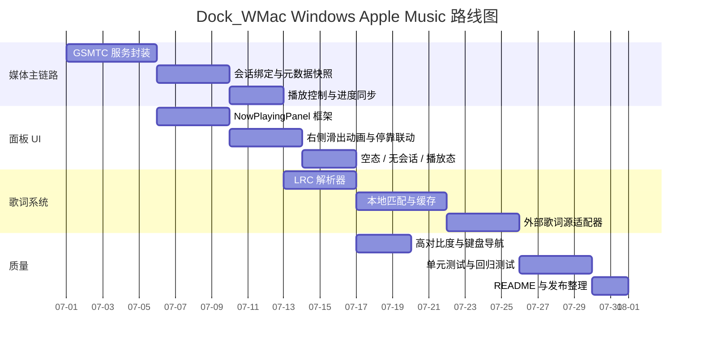

# Dock_WMac README 与设计修订深度研究报告

## 执行摘要

Dock_WMac 当前公开主干已经是一个**纯 Windows 桌面工程**：README 把系统要求限定为 Windows 10/11，强调 Win32 事件、DWM 预览与 Qt6 Widgets；CMake 也只列出了 Windows/Qt 相关源文件，并链接 `dwmapi`、`shell32`、`shlwapi`、`ole32`、`uuid`、`propsys`、`comctl32` 等 Windows 组件。这说明主线最合理的方向不是继续扩展任何 macOS runtime 方案，而是把项目范围进一步收束为“**Windows-only，视觉上受 macOS Dock 启发**”。citeturn37view0turn37view1turn28view0

本会话附带的旧研究稿则明确建议了 AppleScript、Music.app、`NSPanel`/`NSWindow`、Menu Bar 等 macOS 路线；这些内容如果继续留在主 README 或主设计文档里，会直接与当前仓库的 Windows 主线冲突。因此，本次修订的核心不是“继续补完 macOS 方案”，而是**将这些内容从主文档中剥离，归档为历史探索**，并在 README 首页明确写上“Dock_WMac 目标平台是 Windows，不提供 macOS 方案”。fileciteturn0file0L7-L14 fileciteturn0file0L117-L129 fileciteturn0file0L245-L255

Apple Music 支持方面，最稳妥的 Windows 方案是优先依赖 `GlobalSystemMediaTransportControlsSessionManager` 与 `Windows.Media.Control` 命名空间提供的系统媒体会话能力。微软文档明确说明，`GlobalSystemMediaTransportControlsSessionManager` 可访问系统中的播放会话，`GlobalSystemMediaTransportControlsSession` 能提供媒体属性、时间线和播放状态，并尝试执行播放控制；媒体属性中可直接取得 `Title`、`Artist`、`AlbumTitle`、`Thumbnail`，时间线可取得 `Position`、`StartTime`、`EndTime`，播放信息可取得 `PlaybackStatus` 与 `Controls`。这些能力正好覆盖 Dock 侧边播放器需要的“曲目信息 + 进度 + 控制”主链路。citeturn14view0turn14view1turn15view0turn15view1turn16view0

另一方面，不应假设 Windows Apple Music 向第三方暴露了歌词 API。Apple 的 Windows 用户指南只证明 Apple Music for Windows 本身有“查看歌词”和“为其他歌曲添加歌词”的终端用户功能；微软的 `GlobalSystemMediaTransportControlsSessionMediaProperties` 文档则只列出标题、艺术家、专辑、缩略图等字段，并没有任何歌词字段。因此，Dock_WMac 的歌词能力必须设计成**本地 LRC 优先、外部歌词源可插拔、无歌词时优雅降级**，而不是把 Apple Music 原生同步歌词当作 V1 前提。citeturn26view0turn15view0

UI/UX 上，建议采用一个**贴右侧 Dock、默认隐藏、播放时自动横向滑出的面板**。面板左侧是封面，右侧是三层堆叠：歌名、进度条、控制按钮。这个设计既符合你指定的布局，也更接近 TaskbarLyrics 那种“低干扰、强状态机、始终围绕当前播放内容”的产品气质；但与 TaskbarLyrics 不同，Dock_WMac 不应把“任务栏歌词”当作中心，而应把“Dock 伴生播放器”作为主语义，把歌词系统留作一个**不阻塞主链路**的独立子系统。citeturn6view0turn6view1turn6view2turn37view0

## 范围重置与技术立场

### 当前主干的真实边界

当前仓库首页已经把 Dock_WMac 定义为“原生、便携、低干扰的 Windows 应用 Dock”，系统要求也是 Windows 10/11，技术栈为 Qt6 Widgets、Win32 与 DWM 集成；项目结构则是 `include/`、`src/`、`resources/`、`tests/` 的典型 Windows/Qt 桌面工程组织。CMake 进一步列出了 `Application`、`DockManager`、`ConfigManager`、`ProcessMonitor`、`SysHelper`、`WindowCache`、`ClickStateMachine`、`IconProvider`、`PinnedItemsReader`、`DockWindow`、`DockAnimation`、`WindowPreviewPanel`、`OverflowPanel` 等编译单元，没有任何 macOS target 或 Objective-C/Swift 迹象。citeturn37view0turn37view1turn28view0

这意味着 README 修订时应当把“macOS 风格”严格解释为**视觉风格灵感**，而不是平台承诺。更准确的措辞应是“Windows-only、macOS-inspired Dock for Windows”，从一开始就把平台范围、依赖边界和实现语义讲清楚。否则，用户会把“macOS 风格”误读成“未来将支持 macOS”，而这与当前仓库现实并不一致。citeturn37view0turn37view1turn28view0

### 必须从主文档中移除的 macOS 路线

旧研究稿把 AppleScript、Music.app、`NSAppleScript`、Scripting Bridge、`NSPanel`、`NSWindow`、`NSVisualEffectView`、Menu Bar 路线当作主实现方向，这在那份文档内是自洽的，但它面向的是一个 macOS 实验目标，而不是当前这个 Win32/Qt 主仓。对 README 来说，这些内容现在都应从“当前计划”中删除，只能留在归档文档里，明确标注为“**与现阶段 Dock_WMac 主线不兼容的历史探索**”。fileciteturn0file0L7-L14 fileciteturn0file0L119-L129 fileciteturn0file0L147-L152

下面这张对照表给出应删除项与 Windows 替代项：

| 应删除的主线方案 | 为什么不应继续放在主 README | Windows 替代方案 |
|---|---|---|
| AppleScript / `NSAppleScript` | 只适用于 macOS 自动化 Music.app | `GlobalSystemMediaTransportControlsSessionManager` + `GlobalSystemMediaTransportControlsSession` |
| Music.app / Apple Events | 与 Windows Apple Music 无关 | Windows Apple Music 会话 + GSMTC 元数据/控制 |
| `NSWindow` / `NSPanel` / `NSVisualEffectView` | 都是 AppKit 窗口系统概念 | 现有 Qt Widgets 无边框窗口 + Win32 边缘停靠与动画 |
| Menu Bar 常驻方案 | 是 macOS 菜单栏交互，不是当前 Dock 语义 | Dock 图标触发 + 右键菜单 + 可选托盘入口 |
| MusicKit 作为 V1 主链路 | 是 Apple 生态播放能力，不对应 Windows Apple Music 外部控制 | Windows 系统媒体会话监听；必要时仅做未来增强层 |
| Web `Media Session API` | 是浏览器里的 `navigator.mediaSession` Web API | 不适用于本地 Qt/Win32 桌面应用 citeturn21view0 |
| MPRIS | 是 D-Bus 媒体播放器互操作规范 | 不适用于 Windows 桌面媒体控制 citeturn19view0 |

还要特别补一句：微软文档中的 `MediaPlayer` 与 `SystemMediaTransportControls` 集成，语义是“**让你的 app 成为播放者并接入系统媒体控件**”；这适合未来 Dock_WMac 自己播放本地文件，但并不能替代“远程观察和控制 Windows Apple Music”的需求。针对外部播放器会话，主链路仍应是 `Windows.Media.Control` 下的 GSMTC session API。citeturn30view0turn31view0

## Apple Music 接入与歌词策略

### 为什么首选 GSMTC

微软把 `GlobalSystemMediaTransportControlsSessionManager` 定义为系统级播放会话入口，能够获取当前会话和全部会话，并在当前会话变化、会话列表变化时发出事件；单个 `GlobalSystemMediaTransportControlsSession` 则可以返回媒体属性、时间线属性、播放信息，并尝试执行播放/暂停、上一首、下一首、切换播放暂停、修改播放位置等动作。这个能力集与 Dock_WMac 要实现的轻量 Now Playing 面板1比1对齐。citeturn14view0turn14view1turn15view0turn15view1turn16view0

更重要的是，GSMTC 模型天然符合“**外部播放器伴生层**”的产品语义。TaskbarLyrics 也正是通过 SMTC 识别当前歌曲，并据此做主题切换、频谱、双行歌词与多源匹配；这证明“系统媒体会话 + 独立 UI 层”在 Windows 上是一条经验证的路线。Dock_WMac 完全可以借鉴它的状态管理和缓存思路，但不必复制它的任务栏歌词表现形式。citeturn6view0turn6view1turn6view2

针对 Apple Music，最稳妥的说法应当是：**Dock_WMac 将优先尝试通过 GSMTC 读取并控制 Windows Apple Music 的系统媒体会话；若 Apple Music 未暴露完整会话或字段不完整，则回退到只显示基础状态，绝不伪造歌词或假定专有 API 存在。** 这既忠于微软公开 API，也符合 Apple 在 Windows 端只公开用户指南、未公开第三方歌词接口的现实。citeturn14view0turn14view1turn26view0

### 媒体字段、控制能力与缺口

从公开 API 来看，V1 能稳定依赖的字段与操作大体如下：

| 能力 | 公开 API | 是否可作为 V1 主链路 | 说明 |
|---|---|---|---|
| 当前会话选择 | `GetCurrentSession()` | 是 | 先取系统当前会话，再做 Apple Music 过滤或用户偏好绑定 |
| 多会话发现 | `GetSessions()` / `SessionsChanged` | 是 | 用于多播放器共存时重新判定 |
| 标题 / 艺术家 / 专辑 | `TryGetMediaPropertiesAsync()` | 是 | `Title`、`Artist`、`AlbumTitle` 已公开 |
| 封面 | `Thumbnail` | 是 | 但属于 best-effort，读取失败时必须占位 |
| 进度 / 时长 | `GetTimelineProperties()` | 是 | `Position`、`StartTime`、`EndTime` 可用于进度条 |
| 播放状态 | `GetPlaybackInfo()` | 是 | `PlaybackStatus` 决定面板显隐与按钮态 |
| 控制能力探测 | `PlaybackInfo.Controls` | 是 | 控件按能力启用/禁用 |
| 暂停 / 上一首 / 下一首 | `TryPauseAsync()` / `TrySkipPreviousAsync()` / `TrySkipNextAsync()` | 是 | 按钮可直接映射 |
| 拖动进度 | `TryChangePlaybackPositionAsync()` | 可选 | 仅在会话允许 seek 时启用 |
| 歌词 | 无公开字段 | 否 | 必须由本地/外部歌词子系统解决 |

上表的关键结论只有一条：**GSMTC 能做媒体面板，但不能替你解决歌词。** 这不是实现技巧问题，而是 API 暴露范围问题。Apple 的 Windows 用户指南说明 Apple Music app 里确实支持查看歌词、给其他歌曲添加歌词，但这只能证明终端用户功能存在，并不能推出“第三方 Dock 一定能拿到同步歌词数据”。citeturn14view1turn15view0turn15view1turn16view0turn26view0

### 歌词策略与降级链路

歌词系统建议完全独立成一个 `LyricsService`，其输入是**规范化后的曲目元数据**，而不是 Apple Music 私有对象。这样一来，就算未来换播放器、换源、换歌词服务，Dock UI 本身也不需要推倒重来。TaskbarLyrics 已经验证了“播放器对应歌词源优先、失败后跨源检索、再做标题/歌手/时长相似度校验、并叠加缓存与映射”的套路是有效的。citeturn6view0turn6view1

推荐的降级顺序如下：



建议的歌词源比较表如下：

| 歌词来源 | 格式 | 匹配策略 | 缓存策略 | 失败时行为 |
|---|---|---|---|---|
| 用户手动绑定 | `.lrc` / `.txt` | 直接按曲目唯一映射 | 永久缓存，除非用户改绑 | 下一层 |
| 本地自动匹配 | `.lrc` | `title + artist + duration` 相似度 | 建立本地索引 | 下一层 |
| 本地历史缓存 | 规范化 JSON / sqlite | 命中 `sessionKey` 或 `trackKey` | LRU + 最近成功优先 | 下一层 |
| 外部同步歌词源 | LRC-like | 标题、歌手、专辑、时长加权匹配 | TTL 缓存 + 成功映射回写 | 下一层 |
| 外部纯文本歌词 | plain text | 同上，但不要求时间轴 | 文本缓存 | 显示“无同步歌词” |
| 无歌词 | 无 | 不匹配 | 不缓存 | 显示占位状态，不阻塞主 UI |

实现细节上，建议先只把 **LRC** 做完整：支持 `[ar:]`、`[ti:]`、`[al:]`、`[offset:]` 等元标签；支持一个文本行对应多个时间戳；支持 `mm:ss.xx` 与 `mm:ss.xxx`；解析后按 `startMs` 排序，并自动补出 `endMs = next.startMs - 1`。外部歌词适配器则采用接口化设计，初版可以只开放一个可选实现，不把任何特定第三方源写死进 README 主说明。citeturn6view0turn6view1

匹配时建议采用一个保守的加权分：`标题 0.45 + 艺术家 0.30 + 专辑 0.10 + 时长 0.15`。其中标题要做括号与版本后缀归一化，例如去掉 `Live`、`Remaster`、`feat.`、全角半角差异与无意义标点；艺术家则应支持按 `,`、`&`、`feat.`、`/`、`、` 拆分。时长建议设置三级窗口：`±2s` 强匹配，`±5s` 中匹配，`±10s` 弱匹配，超过则直接淘汰。这些都是适合开源桌面工具的默认值，后续可调整。citeturn6view0turn6view1

TaskbarLyrics 还给了两个非常实用的工程启发：一是将歌词缓存与歌曲映射分开保存；二是在运行时目录之外把用户态缓存单独落盘。它的 README 明确写了缓存目录和 `song_maps.db` 的存在。Dock_WMac 可以借鉴这个结构，但继续沿用本项目现有 `data/` 便携优先策略，例如新增 `data/lyrics/cache/`、`data/lyrics/maps.sqlite`、`data/artwork/`。citeturn6view1turn37view0turn37view2

### 建议代码片段

下面给出一个适合 Qt + C++17 + C++/WinRT 的 GSMTC 接入示意。它不是完整可编译成品，但足以作为你重构 `Application` 与媒体服务层的起点。相关 API 能力都来自 `Windows.Media.Control` 的官方文档。citeturn14view0turn14view1turn15view0turn15view1turn16view0

```cpp
// MediaSessionService.h / .cpp 伪代码
#include <winrt/base.h>
#include <winrt/Windows.Foundation.h>
#include <winrt/Windows.Media.Control.h>
#include <QObject>

class MediaSessionService final : public QObject {
    Q_OBJECT
public:
    explicit MediaSessionService(QObject* parent = nullptr);

    void start();
    void refreshNowPlaying();
    void playPause();
    void previous();
    void next();
    void seekToMs(qint64 positionMs);

signals:
    void snapshotChanged();
    void sessionUnavailable();

private:
    void bindCurrentSession();
    void hookSessionEvents();

    winrt::Windows::Media::Control::GlobalSystemMediaTransportControlsSessionManager m_manager{ nullptr };
    winrt::Windows::Media::Control::GlobalSystemMediaTransportControlsSession m_session{ nullptr };
};

void MediaSessionService::start() {
    winrt::init_apartment(winrt::apartment_type::multi_threaded);

    m_manager =
        winrt::Windows::Media::Control::GlobalSystemMediaTransportControlsSessionManager::RequestAsync().get();

    m_manager.CurrentSessionChanged([this](auto&&, auto&&) {
        bindCurrentSession();
    });

    m_manager.SessionsChanged([this](auto&&, auto&&) {
        bindCurrentSession();
    });

    bindCurrentSession();
}

void MediaSessionService::bindCurrentSession() {
    m_session = m_manager.GetCurrentSession();
    if (!m_session) {
        emit sessionUnavailable();
        return;
    }

    m_session.MediaPropertiesChanged([this](auto&&, auto&&) { refreshNowPlaying(); });
    m_session.PlaybackInfoChanged([this](auto&&, auto&&) { refreshNowPlaying(); });
    m_session.TimelinePropertiesChanged([this](auto&&, auto&&) { refreshNowPlaying(); });

    refreshNowPlaying();
}

void MediaSessionService::refreshNowPlaying() {
    if (!m_session) return;

    auto media = m_session.TryGetMediaPropertiesAsync().get();
    auto timeline = m_session.GetTimelineProperties();
    auto playback = m_session.GetPlaybackInfo();

    // 你的 ViewModel:
    // title       <- media.Title()
    // artist      <- media.Artist()
    // album       <- media.AlbumTitle()
    // thumbnail   <- media.Thumbnail()
    // positionMs  <- timeline.Position().count() / 10000
    // durationMs  <- (timeline.EndTime() - timeline.StartTime()).count() / 10000
    // status      <- playback.PlaybackStatus()
    // controls    <- playback.Controls()

    emit snapshotChanged();
}

void MediaSessionService::playPause() {
    if (m_session) m_session.TryTogglePlayPauseAsync().get();
}

void MediaSessionService::previous() {
    if (m_session) m_session.TrySkipPreviousAsync().get();
}

void MediaSessionService::next() {
    if (m_session) m_session.TrySkipNextAsync().get();
}

void MediaSessionService::seekToMs(qint64 positionMs) {
    if (!m_session) return;
    const int64_t ticks = positionMs * 10000; // ms -> 100ns ticks
    m_session.TryChangePlaybackPositionAsync(ticks).get();
}
```

下面是一个保守的 LRC 解析与查找示意，目标是先把本地 LRC 做扎实，再让外部歌词源接入复用同一套 `LyricsDocument` 结构：

```cpp
struct LrcLine {
    int startMs = 0;
    int endMs = 0;
    QString text;
};

struct LyricsDocument {
    QMap<QString, QString> tags;   // ar, ti, al, offset...
    QVector<LrcLine> lines;
    bool synced = false;
};

LyricsDocument parseLrc(const QString& raw) {
    LyricsDocument doc;
    QVector<QPair<int, QString>> pending;
    int globalOffsetMs = 0;

    static QRegularExpression metaRe(R"(^\[(ar|ti|al|by|offset):(.+)\]$)");
    static QRegularExpression timeRe(R"(\[(\d{1,2}):(\d{2})(?:\.(\d{1,3}))?\])");

    for (const QString& row : raw.split('\n')) {
        QString line = row.trimmed();
        if (line.isEmpty()) continue;

        auto meta = metaRe.match(line);
        if (meta.hasMatch()) {
            auto key = meta.captured(1).toLower();
            auto val = meta.captured(2).trimmed();
            doc.tags[key] = val;
            if (key == "offset") globalOffsetMs = val.toInt();
            continue;
        }

        auto it = timeRe.globalMatch(line);
        QVector<int> timestamps;
        while (it.hasNext()) {
            auto m = it.next();
            int mm = m.captured(1).toInt();
            int ss = m.captured(2).toInt();
            int frac = m.captured(3).isEmpty() ? 0 : m.captured(3).leftJustified(3, '0').toInt();
            timestamps.push_back(mm * 60000 + ss * 1000 + frac + globalOffsetMs);
        }

        QString text = line;
        text.remove(timeRe);
        text = text.trimmed();

        for (int t : timestamps) {
            pending.push_back({t, text});
        }
    }

    std::sort(pending.begin(), pending.end(),
              [](auto& a, auto& b) { return a.first < b.first; });

    for (int i = 0; i < pending.size(); ++i) {
        int start = pending[i].first;
        int end = (i + 1 < pending.size()) ? pending[i + 1].first - 1 : start + 5000;
        doc.lines.push_back({start, end, pending[i].second});
    }

    doc.synced = !doc.lines.isEmpty();
    return doc;
}

const LrcLine* findCurrentLine(const LyricsDocument& doc, int posMs) {
    for (const auto& line : doc.lines) {
        if (posMs >= line.startMs && posMs <= line.endMs) return &line;
    }
    return nullptr;
}
```

## Dock 右侧滑出面板规格

### 布局、尺寸与动画

推荐把面板定义为一个**贴右边缘 Dock 图标、向左横向滑出的伴生卡片**，而不是向上展开的独立播放器页。这样更符合当前 Windows Dock 的边缘布局，也能避免与旧 macOS 方案混淆。由于当前 Dock_WMac 已经具备自动隐藏、边缘唤醒、无边框浮层和过渡动画语义，这个面板最适合做成 Dock 的一个附属 surface，而不是第二套主窗口体系。citeturn37view0turn37view1turn28view0

默认建议尺寸如下，且全部标记为**可调默认值**：

| 项目 | 默认值 | 说明 |
|---|---:|---|
| 面板宽度 | 304 px | 紧凑，不压桌面 |
| 面板高度 | 116 px | 能容纳封面、标题、进度、按钮 |
| 外边距 | 12 px | 面板内安全边距 |
| 封面尺寸 | 72 × 72 px | 左侧固定区域 |
| 标题区高度 | 32 px | 单行省略或双行紧凑显示 |
| 进度条高度 | 4 px | Hover 时扩到 6 px |
| 控制按钮 | 28 × 28 px | 推荐可点击热区至少 32 px |
| 面板圆角 | 14 px | 与当前 Dock 风格一致 |
| 滑出时长 | 160 ms | 默认，可调 |
| 收回时长 | 120 ms | 默认，可调 |
| 淡入淡出 | 120–160 ms | 与位移动画同步 |

布局严格遵循你指定的结构：**从左到右是封面 → 内容区；内容区从上到下是歌曲标题 → 进度条 → 控制按钮**。如果需要展示艺术家或歌词，不要破坏这条主轴，而应使用二级方式，例如标题区域里的次级浅色副标题、悬浮 tooltip、或点击后的扩展态。这样既满足主布局约束，也为歌词系统保留后续扩展空间。citeturn6view0turn6view1

一个推荐的 ASCII 草图如下：

```text
屏幕右边缘
│
│   Dock
│    ●  Apple Music 图标
│   ┌──────────────────────────────┐
└──▶│ [封面 72]  歌曲标题           │
    │           ───────────────    │
    │           ▬▬▬▬▬▬───────      │
    │           ◁  ⏯  ▷             │
    └──────────────────────────────┘
         ← 从右向左滑出
```

### 触发逻辑、鼠标键盘与无障碍

建议的显隐状态机如下：当当前系统会话进入 `Playing` 且能获取到最小可用元数据时，面板自动滑出；暂停时保持 3 秒，再视用户设置自动收回；停止或会话消失时立即淡出。若用户把鼠标停在面板上，自动收回计时应暂停。这个状态机应由 `PlaybackStatus` 与 `TimelinePropertiesChanged` 驱动，而不是靠 Dock hover 猜测。citeturn14view1turn15view1turn16view0

具体交互建议如下：

| 场景 | 默认行为 | 备注 |
|---|---|---|
| 播放开始 | 自动滑出 | 用户可关闭自动弹出 |
| 鼠标移入面板 | 保持展开 | 取消自动收回 |
| 单击封面 | 打开 Apple Music 或切回当前会话来源 | 可配置 |
| 单击进度条 | 如果支持 seek，则跳转到对应位置 | 否则只读 |
| 鼠标悬停进度条 | 显示 `mm:ss / mm:ss` | 不需要额外大窗 |
| 单击播放键 | `TryTogglePlayPauseAsync()` | 主按钮 |
| 单击上一首/下一首 | 调用 session 控制方法 | 若未启用则按钮灰显 |
| Esc | 收回面板 | 不隐藏 Dock |
| Tab / Shift+Tab | 在可聚焦控件间切换 | 可见焦点框 |
| Space / Enter | 激活当前焦点控件 | 键盘可用 |
| 左右方向键 | 进度调整 ±5 秒 | 仅在支持 seek 时启用 |

无障碍方面，最重要的是两点。第一，**高对比度与减少动态效果**必须是一级设置，而不是“以后再说”。微软的对比主题文档强调对比主题使用受限调色板以提高可读性，并建议避免在高对比度模式下硬编码颜色。Dock_WMac 因为本来就做半透明、模糊、弱边框，更应该在高对比度模式下切换成纯色背景、明确边框和更高文本对比。第二，按钮和焦点必须全部可键盘操作，进度条也要有明确的可达状态与提示文本。citeturn38view0

还有一个重要的产品判断：**歌词不应阻塞这个面板 MVP**。在你的目标布局下，面板首先是“Now Playing + Progress + Controls”，而不是一个完整歌词窗。我的建议是 V1 只把歌词做成数据与缓存层，UI 端只预留一个次级入口，比如右键菜单中的“打开歌词浮层”“显示当前行 tooltip”“固定歌词面板”。这样就能保证 Windows Apple Music 接入先落地，而不会被歌词牵着走。citeturn15view0turn26view0turn6view0

## 仓库清理与路径改造建议

### 立即修改的现有路径

根据当前 README 与 CMake，以下文件和路径是这轮修订最关键的落点。前两列是**已存在于当前仓库**并可直接改动的路径，第三列是建议动作。现有路径依据公开 README 项目结构和 CMake 文件清单整理。citeturn37view1turn28view0

| 路径 | 动作 | 目的 |
|---|---|---|
| `README.md` | 重写 | 明确 Windows-only、Apple Music on Windows、GSMTC 主链路、歌词降级策略 |
| `CMakeLists.txt` | 修改 | 加入媒体与歌词新源文件，保持 Win32/Qt 主线 |
| `include/core/Application.h` / `src/core/Application.cpp` | 修改 | 应用生命周期中初始化 `MediaSessionService` |
| `include/core/ConfigManager.h` / `src/core/ConfigManager.cpp` | 修改 | 新增媒体面板与歌词缓存配置 |
| `include/ui/DockWindow.h` / `src/ui/DockWindow.cpp` | 修改 | 挂载右侧滑出面板与状态联动 |
| `src/ui/DockWindow_transition.cpp` | 修改 | 复用为面板进入/退出动画 |
| `src/ui/DockWindow_input.cpp` | 修改 | 面板 hover、点击、键盘交互 |
| `src/ui/DockWindow_itemmanager.cpp` | 修改 | 为 Apple Music 图标/状态点增加逻辑 |
| `src/ui/DockAnimation.cpp` | 修改 | 复用或补充 easing/位移动画 |
| `resources/resources.qrc` | 修改 | 增加播放控制图标、占位封面、无歌词状态图标 |
| `tests/` | 扩展 | 增加媒体会话与歌词解析单测 |

当前编译清单中没有 AppleScript、Music.app、`NSWindow`、Menu Bar 对应源码；因此需要“删除”的大概率不是现有 `.cpp/.h` 编译单元，而是**文档、规划稿、后续 PR 描述里的错误方向**。也就是说，这轮工作更像是“清文档语义 + 加 Windows 媒体能力”，而不是“从仓库里删 Objective-C 代码”。citeturn28view0turn37view0turn37view1

### 建议新增的路径

在不破坏现有 UI → Core → System 分层的前提下，建议新增以下文件。它们都保持“Windows-only、Qt 主 UI、WinRT 只在媒体层出现”的原则。

| 新路径 | 职责 |
|---|---|
| `include/core/MediaSessionService.h` |
| `src/core/MediaSessionService.cpp` | 封装 GSMTC 管理器、会话绑定、元数据快照、控制调用 |
| `include/core/NowPlayingSnapshot.h` | 结构化标题、艺术家、封面、时间线、播放状态 |
| `include/core/LyricsService.h` |
| `src/core/LyricsService.cpp` | 歌词查询、缓存、降级逻辑 |
| `include/core/LrcParser.h` |
| `src/core/LrcParser.cpp` | 本地 LRC 解析 |
| `include/core/LyricsMatcher.h` |
| `src/core/LyricsMatcher.cpp` | 标题/歌手/时长相似度评分 |
| `include/ui/NowPlayingPanel.h` |
| `src/ui/NowPlayingPanel.cpp` | 右侧滑出面板本体 |
| `tests/test_media_session.cpp` | 会话快照与状态迁移测试 |
| `tests/test_lrc_parser.cpp` | LRC 解析单测 |
| `tests/test_lyrics_matcher.cpp` | 匹配算法单测 |

这里建议**不要**把 GSMTC 逻辑塞进 `SysHelper`。`SysHelper` 当前角色明显偏 Win32/DWM/Hook 系统工具箱；如果硬塞进外部播放器会话逻辑，后续职责会迅速失控。媒体会话层应当是一个新的 Core service，由 `Application` 管理生命周期，再向 `DockWindow` 与 `NowPlayingPanel` 发信号。这个分层更接近当前项目已经采用的组织方式。citeturn37view0turn37view1turn28view0

需要归档或删改的文档路径方面，当前仓库根目录能看到 `AGENTS.md`、`VALIDATION.md`、`README.md`。如果其中任何文档写入了 AppleScript、Music.app、`NSWindow`、Menu Bar、MusicKit V1 主链路等表述，应全部改成“历史探索”或直接删除；若希望保留讨论痕迹，建议移动到 `docs/archive/` 下并加醒目的 `Not Applicable to Windows Mainline` 提示。citeturn37view0turn28view0

## README.md 建议稿

下面这份 README 草案，将当前公开主干的 Windows 基线、微软 GSMTC 文档约束、Apple Music for Windows 用户端现实，以及 TaskbarLyrics 给出的低干扰状态机启发合并成一个可以直接继续改写的版本。它刻意不再讨论 AppleScript、Music.app、`NSWindow`、Menu Bar 等 macOS 方案。citeturn37view0turn37view1turn28view0turn14view0turn14view1turn26view0turn6view0

```md
# Dock_WMac

> A Windows-only, macOS-inspired Dock for Windows desktop.

Dock_WMac 是一个 **仅面向 Windows 10/11** 的桌面 Dock 项目，提供低干扰的应用启动、窗口切换，以及面向 **Windows Apple Music** 的 Dock 伴生播放面板。

## 项目范围

### Windows-only 声明

Dock_WMac **只支持 Windows**。  
本项目不会提供或维护以下方案：

- AppleScript
- macOS Music.app 集成
- NSWindow / NSPanel / NSVisualEffectView
- macOS Menu Bar 常驻方案

“macOS 风格”仅表示视觉与交互灵感，不表示跨平台目标。

## 当前目标

- 保持现有 Dock 作为主界面
- 在 Dock 右侧增加一个 **隐藏式滑出播放面板**
- 支持 **Windows Apple Music**
- 优先通过 **GlobalSystemMediaTransportControlsSessionManager (GSMTC)** 获取当前媒体会话
- 提供稳定的元数据、进度、播放控制
- 提供 **本地 LRC + 外部歌词源 + 无歌词优雅降级** 的歌词体系

## Apple Music 支持计划

### 主链路

Dock_WMac 不直接接入 Apple 私有播放 API。  
主链路采用 Windows 系统媒体会话：

- `GlobalSystemMediaTransportControlsSessionManager`
- `GlobalSystemMediaTransportControlsSession`
- `TryGetMediaPropertiesAsync`
- `GetTimelineProperties`
- `GetPlaybackInfo`
- `TryTogglePlayPauseAsync`
- `TrySkipPreviousAsync`
- `TrySkipNextAsync`
- `TryChangePlaybackPositionAsync`

### 设计原则

- 优先绑定系统当前媒体会话
- 若检测到多个会话，优先选择用户当前活跃的 Apple Music 会话
- 若 Apple Music 会话元数据不完整，则回退到基础状态展示
- **不假设 Apple Music 对第三方公开歌词 API**
- 歌词系统不阻塞播放面板主链路

## 歌词策略

### 初始支持范围

V1 先支持：

- 本地 `.lrc`
- 本地纯文本歌词
- 可插拔外部歌词源适配器
- 本地缓存与曲目映射

### 匹配策略

基础匹配字段：

- 标题
- 艺术家
- 专辑
- 时长

标题会做规范化处理：

- 去除括号版本后缀
- 统一大小写
- 统一全角半角
- 去除常见 `feat.` / `ver.` / `live` / `remaster` 后缀噪音

### 缓存与回退顺序

| 优先级 | 歌词来源 | 匹配方式 | 缓存策略 | 失败后行为 |
|---|---|---|---|---|
| 高 | 用户手动绑定 LRC | 直接映射 | 永久缓存 | 下一层 |
| 高 | 本地自动匹配 LRC | 标题+艺术家+时长 | 本地索引 | 下一层 |
| 中 | 历史缓存歌词 | trackKey / sessionKey | LRU + 最近成功优先 | 下一层 |
| 中 | 外部同步歌词源 | 元数据加权匹配 | TTL 缓存 | 下一层 |
| 低 | 外部纯文本歌词 | 模糊匹配 | TTL 缓存 | 下一层 |
| 最低 | 无歌词 | 无 | 不缓存 | 显示“暂无歌词” |

### 无歌词时的行为

若没有可用歌词：

- 主播放面板照常显示
- 不阻塞封面、进度和控制按钮
- 显示“暂无歌词”或“仅显示当前播放信息”
- 不伪造歌词，不猜测 Apple Music 私有接口

## Dock 滑出面板规格

### 交互

- 面板贴靠在 Dock 右边缘
- 当检测到音乐进入播放状态时自动滑出
- 默认从右向左滑出
- 鼠标移入时保持展开
- 鼠标移出后按设置延迟收回
- Esc 可收回
- 可通过设置关闭自动弹出

### 布局

从左到右：

- 专辑封面
- 内容区

内容区从上到下：

- 歌曲标题
- 进度条
- 控制区

控制区包含：

- 上一首
- 播放 / 暂停
- 下一首

### 默认尺寸

> 以下默认值均可调整

- 面板宽度：304 px
- 面板高度：116 px
- 封面：72 × 72 px
- 内边距：12 px
- 进度条高度：4 px
- 按钮：28 × 28 px
- 圆角：14 px
- 滑出动画：160 ms
- 收回动画：120 ms

### 可访问性

- 支持键盘焦点
- 支持高对比度主题
- 减少动态效果可关闭动画
- 禁止仅靠颜色表示状态
- 禁止在高对比度模式下硬编码关键文本颜色

## 实现路线

### 第一阶段

- 建立 `MediaSessionService`
- 接入 GSMTC
- 获取标题 / 艺术家 / 专辑 / 封面 / 进度 / 状态
- 完成播放 / 暂停 / 上一首 / 下一首

### 第二阶段

- 新增 `NowPlayingPanel`
- 接入 Dock 右侧滑出动画
- 接入标题、进度条、按钮状态刷新
- 完成空态、无会话态、播放态切换

### 第三阶段

- 新增 `LrcParser`
- 新增 `LyricsService`
- 支持本地 LRC 导入
- 支持歌词缓存
- 支持外部歌词源适配器
- 完成无歌词优雅降级

### 第四阶段

- 高对比度支持
- 键盘导航
- 单元测试
- 性能与回归测试
- 文档完善

## 代码指引

建议修改的现有路径：

- `README.md`
- `CMakeLists.txt`
- `include/core/Application.h`
- `src/core/Application.cpp`
- `include/core/ConfigManager.h`
- `src/core/ConfigManager.cpp`
- `include/ui/DockWindow.h`
- `src/ui/DockWindow.cpp`
- `src/ui/DockWindow_transition.cpp`
- `src/ui/DockWindow_input.cpp`
- `src/ui/DockWindow_itemmanager.cpp`
- `src/ui/DockAnimation.cpp`
- `resources/resources.qrc`

建议新增的路径：

- `include/core/MediaSessionService.h`
- `src/core/MediaSessionService.cpp`
- `include/core/NowPlayingSnapshot.h`
- `include/core/LyricsService.h`
- `src/core/LyricsService.cpp`
- `include/core/LrcParser.h`
- `src/core/LrcParser.cpp`
- `include/core/LyricsMatcher.h`
- `src/core/LyricsMatcher.cpp`
- `include/ui/NowPlayingPanel.h`
- `src/ui/NowPlayingPanel.cpp`
- `tests/test_media_session.cpp`
- `tests/test_lrc_parser.cpp`
- `tests/test_lyrics_matcher.cpp`

## 路线图



## 非目标

当前阶段不做：

- macOS 支持
- AppleScript / Music.app 方案
- Menu Bar 方案
- MPRIS
- Web Media Session API
- 假设 Apple Music 有公开歌词 API
- 把 Dock_WMac 变成完整播放器本体

## 开源说明

Dock_WMac 保持现有 MIT 许可策略。  
可参考 TaskbarLyrics 的状态机、歌词容错与缓存设计思路，但不直接照搬任务栏交互语义。
```

这份 README 草案的关键优点在于，它把“当前仓库现实”“Windows Apple Music 接入现实”“歌词能力边界”“UI 目标”和“工程落点”一次性写清楚了。它尤其避免了最容易造成项目偏航的三件事：一是把 macOS 方案继续写成主线；二是把 Apple Music 私有歌词能力默认当成存在；三是把 Dock_WMac 误写成一个要自行播放音频的完整播放器。citeturn37view0turn28view0turn15view0turn26view0turn30view0turn31view0